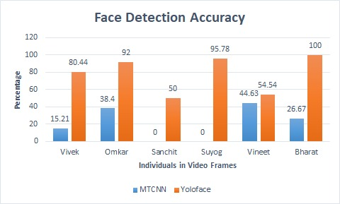

# Covid-19-Masked-Face-Detection-using-YoloFace

Covid-19 Masked Face Person Re-Identification

This is a person Re-Identification project which was carried out by first Face Detection by MTCNN model and then Face Recognition by the VGGFace model. However, with the current pandemic senario, this project moved its focus to Masked Face (Occlusion) Detection. But in doing so, the MTCNN model did not fetch expected results hence, different approaches like YOLO-face, YOLOv3 and RetinaFace algorithms were introduced.

## Dataset
The data consists of videos of 7 individuals that are split at 1fps to produce more than 1000 frames. The videos are taken in different settings such as occlusion, appearance changes, lighting, cropping, rotation, etc.

## Process
1) The video is spit into frames then Faces are extracted using YOLO-face/RetinaFace.
2) An image of the person to be identified is provided and compared with the faces in the database via VGGFace2. If it belongs to the known individual's database, the name of the person is displayed.
3) VGGFace2 (ResNEt-50 architecture) was used to compare the person to be re-idetified with the video frames.

## Results

### Face Detection comparison between MTCNN and YoloFace on Masked Faces.

### Face Detection
Bounding Box colors: YOLO-face - Yellow, YOLOv3 - Red, and RetinaFace - Blue

### VGGFace2 Person Verification

### Overall Performance (Detection + Verification)

The overall accuracies for the different algorithms on the masked faces are:
* Custom trained YOLOv3: 60.4%
* YOLO-face + VGGFace2: 72.5%
* RetinaFace + VGGFace2: 92.7%

### Requirements

TensorFlow version 2.2.0\
Keras version 2.3.1
