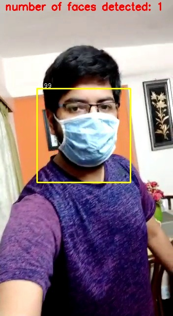

# Covid-19-Masked-Face-Detection-using-YoloFace

Covid-19 Masked Face Person Re-Identification using YoloFace and VggFace
https://github.com/Vivek-23-Titan/Covid-19-Masked-Face-Detection-using-YoloFace/blob/master/Covid_19_Mask_Face_Detection_Yolo_Face.ipynb
This is a person Re-Identification project which was carried out by first Face Detection by MTCNN model and then Face Recognition by the VGGFace model. However, with the current pandemic senario, this project moved its focus to Masked Face (Occlusion) Detection. But in doing so, the MTCNN model did not fetch expected results hence, YoloFace model was introduced.(paper - https://link.springer.com/article/10.1007/s00371-020-01831-7)

## Process
1) The video is spit into frames then Faces are extracted using YoloFace.
2) An image of the person to be identified is provided and compared with the faces in the database via VGGFace. If it belongs to the known individual's database, the name of the person is displayed.
3) VGGFace is used to compare the person to be re-idetified with the video frames.

## Code
The code is available in Juypter notebook.

## Results

### Face Detection comparison between MTCNN and YoloFace on Masked Faces.

### YoloFace Bounding Box

### VGGFace Face Recognition Accuracy

The Overall Acccuracy for MTCNN detected frames on unmasked faces was 99.241%.
The Overall Accuracy for YoloFace System (With several modifications) detected frames on masked faces was approximately 94%.

### Requirements

TensorFlow version 2.2.0\
Keras version 2.3.1
